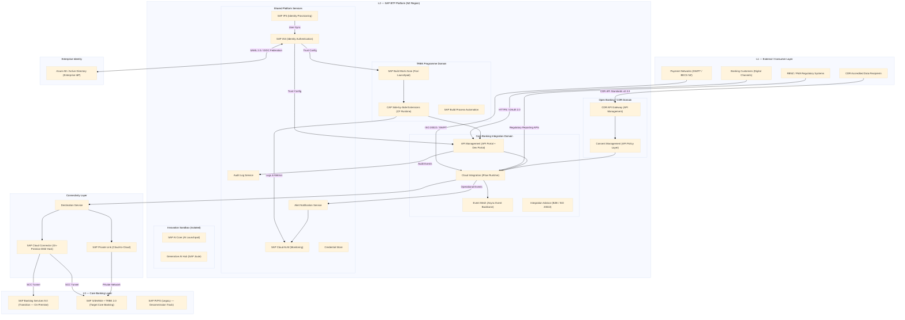

# SAP Business Technology Platform — Foundation
## High Level Design Document
### Banking Sector | New Zealand | Initial Platform Onboarding

---

| Field | Value |
|---|---|
| **Document Title** | SAP BTP Foundation — High Level Design |
| **Customer** | [Banking Organisation — New Zealand] |
| **Document Version** | 0.1 — Draft |
| **Classification** | Confidential — External Distribution Approved |
| **Prepared by** | [Author] |
| **Reviewed by** | [Reviewer] |
| **Date** | August 2026 |
| **Target Customer Location** | New Zealand |
| **Regulatory Jurisdiction** | RBNZ \| FMA \| MBIE |
| **Target Core Banking System** | SAP Transactional Banking for SAP S/4HANA 2.0 (TRBK 2.0) — SAP Fioneer |
| **Core System Conversion** | In-flight migration from SAP Banking Services 9.0 (on-premise) to SAP TRBK 2.0 |
| **Document Intent** | Defines the foundational architecture and strategic intent for introducing SAP BTP into a New Zealand-based banking customer's landscape for the first time. SAP BTP is positioned as the integration, extension, and intelligence layer that runs alongside — and actively enables — the customer's conversion journey from SAP Banking Services 9.0 to SAP TRBK 2.0, while laying the governed platform foundation for broader digital transformation. |

---

## Table of Contents

1. [Initiative](#1-initiative)
2. [Business Capabilities](#2-business-capabilities-enabled)
3. [Customer Outcomes](#3-customer-outcomes)
4. [Opportunities](#4-opportunities-addressed)
5. [Scope & Boundaries](#5-scope--boundaries)
6. [Architecture Principles](#6-architecture-principles)
7. [Reference Architecture & Subaccount Topology](#7-reference-architecture--subaccount-topology-design)
8. [Integration Architecture](#8-integration-architecture)
9. [Roadmap & Phasing](#9-roadmap--phasing)
10. [Risks & Mitigations](#10-risks--mitigations)
11. [Appendices](#11-appendices)

---

## 1. Initiative

### 1.1 Strategic Initiative Statement

The organisation is embarking on a foundational adoption of SAP Business Technology Platform (BTP)
to establish a governed, scalable, and secure cloud platform that underpins digital transformation
across its core banking and enterprise operations in New Zealand. This initiative is being delivered
in parallel with — and is architecturally coupled to — the customer's strategic conversion programme
from **SAP Banking Services 9.0** (on-premise, ECC-based) to **SAP Transactional Banking for SAP
S/4HANA 2.0 (TRBK 2.0)**, the modern open core banking platform built on SAP S/4HANA and delivered
by SAP Fioneer.

SAP BTP represents the first deliberate step in building a strategic integration, extension, and
intelligence layer that bridges the existing Banking Services 9.0 landscape with the target TRBK 2.0
state — and then expands beyond the core banking programme to serve the bank's broader enterprise and
digital ambitions.

### 1.2 Core System Context — SAP Banking Services 9.0 → SAP TRBK 2.0

Understanding the customer's core system conversion is essential context for sizing and sequencing
the BTP Foundation. Key characteristics of the conversion programme are:

- **Source system**: SAP Banking Services 9.0 — on-premise, running on SAP NetWeaver / ECC, covering
  account management, deposits, loans, payments (BS9, BS11, BS13), interest, fees, and statements.
  Integrations are predominantly PI/PO or point-to-point.
- **Target system**: SAP Transactional Banking for SAP S/4HANA 2.0 (TRBK 2.0, CB4HANA 200) — an open,
  API-first core banking platform built on SAP S/4HANA Foundation 2022/2023, underpinned by the HANA
  Universal Journal (ACDOCA). Benchmarked at 15,000+ TPS with 99.99% availability. Functional scope
  covers retail and corporate banking: deposits, savings, lending, payments, account contracts, and
  card/account servicing.
- **Conversion nature**: This is a major transformation, not a technical upgrade. It involves
  uninstalling Banking Services add-ons, updating to an S/4HANA Foundation release, installing the
  TRBK add-on, rebuilding business processes natively in TRBK, and migrating banking master and
  transactional data (accounts, balances, interest data, mandates, payment advice).
- **Integration landscape change**: Existing PI/PO-based interfaces must be re-evaluated and migrated
  to SAP Integration Suite (BTP) as part of or alongside the TRBK conversion.
- **Clean core posture**: TRBK 2.0 on S/4HANA introduces a clean core discipline — all custom
  extensions and workflow enhancements embedded in Banking Services must be re-implemented as
  side-by-side extensions on BTP using CAP, SAP Build, or BTP Kyma runtime.

### 1.3 Initiative Objectives

- Establish a production-ready SAP BTP Global Account structure with governance controls aligned to
  banking-grade security and compliance standards: RBNZ Guidance on Cyber Resilience, RBNZ BS11,
  Deposit Takers Act 2023 (DTA), ISO 27001, and SOC 2.
- Define a Subaccount and Directory topology supporting environment segregation
  (Dev / Test / UAT / Production) aligned to the bank's organisational and cost allocation model,
  including dedicated subaccount structures for the TRBK conversion programme workstreams.
- Onboard foundational BTP services — Identity & Access Management, Connectivity, Integration Suite,
  and Extension capabilities — as the baseline for subsequent workloads, with Integration Suite
  positioned as the strategic replacement for the existing PI/PO integration layer.
- Provide BTP as the side-by-side extension platform for Banking Services 9.0 customisations that
  must be re-implemented outside the TRBK clean core, ensuring no custom logic is re-embedded into
  TRBK during conversion.
- Establish a Centre of Excellence (CoE) operating model and governance framework to manage platform
  growth, service entitlements, cost controls, and security posture across both the TRBK programme
  and business-as-usual BTP workloads.
- Lay the technical and organisational foundation for consuming BTP-native AI, data, and automation
  capabilities in future phases — including AI-assisted TRBK operational tooling and open banking API
  enablement under the Customer and Product Data Act 2025.

---

## 2. Business Capabilities Enabled

### 2.1 Integration & Connectivity

- **Hybrid Integration**: Seamlessly connect on-premise core banking systems (e.g. SAP S/4HANA,
  third-party CBS platforms) to cloud-native services via SAP Integration Suite using pre-built
  adapters, Open Connectors, and Cloud Integration flows.
- **API Management**: Expose, govern, and manage banking APIs securely — enabling compliance with
  New Zealand's Customer and Product Data Act 2025 (CDR), Payments NZ API Centre standards (v2.3.3),
  and internal service reuse across the enterprise.
- **Event-Driven Architecture**: Leverage SAP Event Mesh to decouple systems and support real-time
  event streaming across loan origination, payments, and customer lifecycle events.
- **B2B / EDI Integration**: Streamline regulatory reporting and inter-bank messaging through
  structured B2B integration capabilities.

### 2.2 Extension & Development

- **Side-by-Side Extensions**: Build and deploy low-disruption extensions to core SAP systems without
  touching the clean core.
- **SAP Build — Low-Code/No-Code**: Empower business and citizen developers to create process
  automation, apps, and AI-assisted workflows using SAP Build Apps, Build Process Automation, and
  Build Work Zone.
- **Full-Stack Cloud Application Development**: Use SAP Cloud Application Programming Model (CAP) and
  SAP BTP, Cloud Foundry / Kyma runtime to develop cloud-native banking applications.

### 2.3 Data & Analytics

- **Unified Data Access**: Federate data across SAP and non-SAP sources using SAP Datasphere, enabling
  a governed data fabric without full data movement.
- **Embedded Analytics**: Surface contextual KPIs and operational analytics directly within banking
  workflows using SAP Analytics Cloud integrated with BTP.
- **Data Product Management**: Define, govern, and share trusted data products (e.g. customer 360,
  credit risk metrics) across lines of business.

### 2.4 AI & Intelligent Automation

- **SAP Joule / Generative AI Hub**: Access curated LLM capabilities via SAP AI Core and AI Launchpad
  to build intelligent features within banking processes.
- **Process Automation & Intelligent RPA**: Automate repetitive back-office processes such as
  reconciliation, KYC document processing, and regulatory report generation.
- **Predictive Capabilities**: Leverage ML model lifecycle management for risk scoring, churn
  prediction, and fraud signal enrichment.

### 2.5 Security, Identity & Compliance

- **Centralised Identity Management**: Integrate with the bank's enterprise IdP (Azure AD / Active
  Directory) via SAP Cloud Identity Services (IAS/IPS) for SSO and centralised user provisioning.
- **Role-Based Access Control (RBAC)**: Enforce least-privilege access across BTP services with
  auditable role assignments.
- **Audit & Compliance Logging**: Maintain tamper-evident audit logs via SAP Audit Log Service to
  support RBNZ cyber resilience reporting obligations.
- **Data Residency & Sovereignty**: Configure BTP subaccounts in AWS Asia Pacific (New Zealand) —
  Auckland or Azure New Zealand North via SAP Sovereign Cloud to meet RBNZ data residency preferences.

### 2.6 Platform Governance & FinOps

- **Entitlement & Quota Management**: Govern service consumption and licensing across subaccounts.
- **Cost Transparency**: Allocate BTP consumption costs by business unit, environment, or project.
- **Policy & Compliance Guardrails**: Enforce platform policies (approved service plans, IP
  allowlisting, network restrictions) across the account hierarchy.

---

## 3. Customer Outcomes

### 3.1 Operational Outcomes

- **Reduced Integration Complexity**: Consolidate fragmented point-to-point integrations into a
  governed, observable integration layer — reducing maintenance overhead and incident response time.
- **Faster Time-to-Market**: Accelerate delivery of new banking products, regulatory changes, and
  digital features by decoupling innovation from core system upgrade cycles.
- **Improved Operational Resilience**: High-availability, multi-AZ BTP service deployments reduce
  single points of failure — directly supporting DTA 2023 Operational Resilience Standard obligations.
- **Clean Core Preservation**: Extensions and customisations hosted on BTP reduce upgrade complexity
  and risk of S/4HANA and TRBK system upgrades.

### 3.2 Business Outcomes

- **NZ Consumer Data Right (CDR) Compliance**: API Management capabilities directly support the bank's
  obligations under the Customer and Product Data Act 2025 (in force 1 December 2025 for the four
  major NZ banks; Kiwibank from 1 June 2026), enabling compliant data-sharing endpoints aligned to
  Payments NZ API Centre standards v2.3.3.
- **Customer Experience Enhancement**: Unified data and event-driven integration enables personalised,
  real-time customer interactions across channels.
- **Regulatory Agility**: Faster adaptation to RBNZ, FMA, and AML/CFT legislative changes through
  configurable integration flows and automated compliance reporting.
- **Cost Optimisation**: Reduced reliance on bespoke middleware, legacy ETL tools, and siloed RPA
  platforms through platform consolidation on BTP.

### 3.3 Strategic Outcomes

- **Platform as a Foundation for AI Adoption**: A governed BTP foundation is the prerequisite for safe,
  auditable AI adoption — enabling the bank to leverage SAP Generative AI Hub within enterprise
  guardrails, with data residency maintained in New Zealand.
- **Vendor-Aligned Roadmap**: Alignment with SAP's strategic platform direction ensures the bank
  benefits from continuous platform innovation without re-platforming costs.
- **Ecosystem Enablement**: A governed API layer and event mesh position the bank to participate in
  open banking ecosystems, banking-as-a-service models, and fintech partner integrations under the
  NZ CDR framework.

---

## 4. Opportunities Addressed

### 4.1 Regulatory & Compliance Opportunities

| Opportunity | Relevant Regulation | BTP Capability | Value |
|---|---|---|---|
| NZ Consumer Data Right — open banking API exposure | Customer and Product Data Act 2025; Payments NZ API Centre v2.3.3 | API Management (Integration Suite) | Compliant data-holder endpoints with policy enforcement, throttling, and audit trail |
| Operational Resilience — outsourcing governance | RBNZ BS11; DTA 2023 Operational Resilience Standard | BCP-aware subaccount topology, HA multi-AZ services | Demonstrable resilience with documented due diligence for RBNZ |
| Cyber Incident Reporting | RBNZ Cyber Resilience Reporting (2024) — 72-hour material incident reporting | SAP Audit Log Service; BTP Alert Notification Service | Automated, traceable incident detection and notification |
| Third-Party ICT Governance | RBNZ Guidance on Cyber Resilience; DTA 2023 Non-Core Standards | IAS, XSUAA, Audit Log Service | Centralised identity, role governance, and audit evidence |
| AML/CFT data integration | AML/CFT Act 2009 | Integration Suite + Datasphere | Real-time transaction monitoring data pipelines |
| Privacy & Data Handling | Privacy Act 2020 (NZ) | BTP data residency controls; SAP Cloud Identity Services | Personal data kept within NZ jurisdiction with consent-driven access |
| Regulatory reporting automation | RBNZ periodic reporting; FMA conduct reporting | Build Process Automation + Integration Suite | Reduced manual effort and error risk in regulatory submissions |

### 4.2 Digital Transformation Opportunities

| Opportunity | BTP Capability | Value |
|---|---|---|
| Self-service customer portals | SAP Build Apps + Work Zone | Accelerated delivery of digital banking features aligned to CDR consent flows |
| Intelligent document processing | SAP AI Core + Build Process Automation | Automated KYC, loan document extraction, straight-through processing |
| Banker productivity tools | SAP Joule + CAP-based extensions | AI-assisted relationship manager workflows within SAP CRM/Fiori |
| Payment reconciliation automation | Integration Suite + Build Process Automation | Reduction in overnight batch reconciliation exceptions |

### 4.3 Data & Analytics Opportunities

| Opportunity | BTP Capability | Value |
|---|---|---|
| Customer 360 data product | SAP Datasphere (Data Fabric) | Unified customer view across core banking, CRM, and risk systems |
| Credit risk analytics | SAP Analytics Cloud + AI Core | Predictive risk scoring embedded in credit decisioning workflows |
| Fraud detection signal enrichment | Event Mesh + AI Core | Real-time anomaly signals surfaced to fraud management platforms |
| Executive reporting consolidation | SAP Analytics Cloud + Datasphere | Single source of truth for board and RBNZ regulatory reporting |

### 4.4 Architecture Modernisation Opportunities

| Opportunity | BTP Capability | Value |
|---|---|---|
| Legacy middleware decommission | Integration Suite replacing on-prem PI/PO | Reduced infrastructure and licensing cost |
| API-first architecture adoption | API Management + Event Mesh | Decoupled, reusable services replacing point-to-point integrations |
| SAP S/4HANA clean core enablement | CAP extensions on BTP | Custom logic moved off-stack, simplifying future TRBK upgrades |
| Multi-cloud / hybrid connectivity | Cloud Connector + Private Link | Secure, low-latency connectivity to on-premise and multi-cloud workloads |

---

## 5. Scope & Boundaries

### 5.1 Overview

This section defines what is explicitly in scope and out of scope for the SAP BTP Foundation
initiative, and establishes the boundary between BTP Foundation delivery and the parallel
SAP Banking Services 9.0 → TRBK 2.0 conversion programme. Clear scope boundaries are critical
given the overlapping timelines and shared dependencies on integration landscape, identity
management, and system connectivity.

### 5.2 In Scope

#### 5.2.1 Platform Foundation & Account Structure

| # | In-Scope Item | Description |
|---|---|---|
| S01 | Global Account provisioning | SAP BTP Global Account establishment, entitlement assignment, global admin configuration |
| S02 | Directory & Subaccount topology | Design and provisioning of 5 Directories and 15 Subaccounts covering Dev/Test/UAT/Production |
| S03 | Entitlement & quota management | Service plan and quota assignment; governance controls |
| S04 | BTP Cockpit access governance | RBAC for BTP Cockpit; Global/Subaccount Admin role assignments |
| S05 | BTP FinOps baseline | Cost centre tagging, usage monitoring, alerting thresholds |

#### 5.2.2 Identity & Access Management

| # | In-Scope Item | Description |
|---|---|---|
| S06 | SAP Cloud Identity Services — IAS | Provisioning and configuration; trust config with enterprise IdP (Azure AD) for SSO |
| S07 | SAP Cloud Identity Services — IPS | Automated user and group synchronisation from Azure AD to BTP |
| S08 | XSUAA / Authorization management | Role Collections per subaccount; OAuth 2.0 token issuance |
| S09 | Custom IdP federation | Corporate IdP federation into IAS for SSO across all BTP services |

#### 5.2.3 Connectivity

| # | In-Scope Item | Description |
|---|---|---|
| S10 | SAP Cloud Connector installation | HA pair deployed in DMZ; connects BTP subaccounts to on-premise systems |
| S11 | Destination Service configuration | Connection parameters, authentication credentials, proxy settings |
| S12 | Private Link Service evaluation | Assessment and configuration for direct private network connectivity |
| S13 | Connectivity to SAP BS9 | Cloud Connector virtual mapping and access control for Banking Services 9.0 |
| S14 | Connectivity to SAP TRBK 2.0 | Cloud Connector and Destination configuration for target S/4HANA TRBK 2.0 system |

#### 5.2.4 Integration Suite — Foundation Setup

| # | In-Scope Item | Description |
|---|---|---|
| S15 | SAP Integration Suite provisioning | Subscription and activation in Production and Non-Production subaccounts |
| S16 | Cloud Integration (CPI) setup | Runtime configuration, tenant admin, transport management baseline, monitoring |
| S17 | API Management setup | API Portal and Developer Portal provisioning; API Gateway policy baseline |
| S18 | API Business Hub Enterprise baseline | Internal API cataloguing and discovery — foundation for CDR API exposure |
| S19 | Event Mesh provisioning | Service instance and namespace setup as the foundational event broker |
| S20 | PI/PO interface inventory & migration assessment | Structured assessment of PI/PO landscape; classification and prioritised migration roadmap (**Note**: actual iFlow migration is out of scope for BTP Foundation) |

#### 5.2.5 Security & Compliance Baseline

| # | In-Scope Item | Description |
|---|---|---|
| S21 | Audit Log Service activation | Provisioning and configuration for RBNZ Cyber Resilience Reporting compliance |
| S22 | Alert Notification Service | Setup and integration with bank's SIEM / monitoring tooling |
| S23 | Network restrictions & IP allowlisting | Configuration at BTP subaccount level |
| S24 | Security hardening baseline | BTP security best practices: TLS enforcement, MFA for admins, session controls |
| S25 | RBNZ outsourcing notification support | Due diligence documentation to support BS11 / DTA cloud outsourcing notification |

#### 5.2.6 SAP Build Work Zone — Standard Edition

| # | In-Scope Item | Description |
|---|---|---|
| S26 | SAP Build Work Zone provisioning | Central launchpad and application portal for BTP and TRBK-integrated Fiori apps |
| S27 | Fiori launchpad baseline configuration | Site, role-based navigation, initial TRBK Fiori tile configuration |

#### 5.2.7 BTP CoE & Governance Framework

| # | In-Scope Item | Description |
|---|---|---|
| S28 | CoE operating model definition | Roles, responsibilities, RACI, governance cadence |
| S29 | Platform onboarding runbook | Subaccount provisioning, service onboarding, and access request procedures |
| S30 | Transport & change management baseline | SAP Content Agent Service; DEV→Test→UAT→Production transport pipeline |

### 5.3 Out of Scope

#### 5.3.1 TRBK 2.0 Conversion Programme (Separate Programme)

| # | Out-of-Scope Item | Rationale / Owner |
|---|---|---|
| O01 | SAP S/4HANA Foundation installation and configuration | TRBK programme |
| O02 | TRBK 2.0 functional configuration — account management, deposits, loans, payments | TRBK programme / SAP Fioneer |
| O03 | Banking Services 9.0 uninstall and add-on conversion | TRBK programme |
| O04 | Core banking data migration (accounts, balances, interest data, mandates, payment advice) | TRBK programme |
| O05 | TRBK payment flows reconfiguration (ISO 20022, BCM, scheme certification) | TRBK programme |
| O06 | TRBK parallel run, reconciliation testing, and cutover | TRBK programme |
| O07 | SAP S/4HANA Finance / Universal Journal (ACDOCA) configuration | TRBK / Finance programme |

#### 5.3.2 Integration Migration (Separate Phase)

| # | Out-of-Scope Item | Rationale |
|---|---|---|
| O08 | Migration of individual PI/PO iFlows to Integration Suite | Follows BTP Foundation; addressed in BTP Integration Programme. Foundation delivers assessment only (S20) |
| O09 | B2B/EDI trading partner agreement migration | Integration Programme phase |
| O10 | End-to-end integration testing of migrated iFlows | Integration Programme phase |

#### 5.3.3 Future BTP Phases

| # | Out-of-Scope Item | Target Phase |
|---|---|---|
| O11 | SAP Datasphere implementation | Data & Analytics phase |
| O12 | SAP Analytics Cloud implementation | Data & Analytics phase |
| O13 | SAP AI Core / Generative AI Hub / SAP Joule | AI & Intelligence phase |
| O14 | SAP Build Process Automation | Intelligent Automation phase |
| O15 | CDR / Open Banking API exposure (Customer and Product Data Act 2025) | Open Banking phase |
| O16 | SAP Build Apps application development | Application Development phase |

#### 5.3.4 Customer-Owned Responsibilities

| # | Out-of-Scope Item | Customer Team |
|---|---|---|
| O17 | Azure AD / Active Directory configuration and Group structure | IAM team |
| O18 | Network infrastructure — firewall rules, DMZ, VPN/MPLS topology | Network / Infrastructure team |
| O19 | Physical / virtual server provisioning for Cloud Connector host | Infrastructure team |
| O20 | SAP contract negotiation and BTP licensing / entitlement procurement | Procurement / SAP Account Executive |
| O21 | RBNZ outsourcing notification submission | CRO / Legal / Risk team |
| O22 | Endpoint security on Cloud Connector host | Security Operations team |
| O23 | Business process redesign for TRBK | Business / TRBK programme team |

### 5.4 Programme Boundary — BTP Foundation vs. TRBK 2.0 Conversion

| Interaction Point | BTP Foundation Responsibility | TRBK Programme Responsibility |
|---|---|---|
| Connectivity to TRBK 2.0 | Configure Cloud Connector and Destinations (S10, S14) | Provide hostname, RFC/OData service activation, network access approvals |
| Fiori launchpad for TRBK | Provision Work Zone and configure navigation (S26, S27) | Define TRBK Fiori app catalogue, business roles, tile assignments |
| Integration Suite for TRBK interfaces | Deliver Integration Suite runtime and assessment (S15–S20) | Define integration requirements and TRBK API/service specifications |
| Identity & SSO for TRBK users | Configure IAS/IPS trust with enterprise IdP (S06–S09) | Define TRBK user roles; validate SSO against TRBK Fiori apps |
| Clean core extensions | Provide BTP extension runtime (CAP/Kyma/Build) | Confirm BS9 customisations that must move to BTP |
| Security & audit | Deliver BTP Audit Log Service and Alert Notification (S21–S22) | Align TRBK security events with BTP monitoring |
| Environment alignment | Provision Dev/Test/UAT/Prod subaccounts | Align TRBK system landscape to matching BTP subaccount tiers |

### 5.5 Assumptions

| # | Assumption |
|---|---|
| A01 | Active SAP Universal ID, S-User, and signed BTP contract with entitlements allocated prior to Foundation delivery |
| A02 | Customer's enterprise IdP (Azure AD) accessible; Identity team can provide federation metadata and Group-to-Role mappings |
| A03 | Customer's network team can provision a dedicated host (VM or physical) in DMZ for SAP Cloud Connector |
| A04 | BS9 and TRBK 2.0 hostnames, RFC destinations, and OData/API endpoints provided by TRBK programme ahead of connectivity configuration |
| A05 | TRBK 2.0 programme has a defined system availability schedule (DEV→QAS→PRD) enabling BTP subaccount tiers to be aligned |
| A06 | Customer's security and risk team manages RBNZ BS11/DTA outsourcing notification; BTP Foundation provides supporting documentation (S25) |
| A07 | Data residency requirements confirmed as NZ Primary region (AWS Auckland / Azure NZ North); SAP BTP region selection validated against SAP Discovery Center at provisioning time |
| A08 | PI/PO interface landscape assessment (S20) conducted as time-boxed discovery; customer provides PI/PO system access and documentation |
| A09 | BTP Foundation does not include end-user training; separate enablement workstream planned by CoE |
| A10 | BTP CoE will be staffed with at least one dedicated Platform Owner and one Integration Lead prior to production go-live |

### 5.6 Dependencies

| # | Dependency | Depends On | Impact if Delayed |
|---|---|---|---|
| D01 | BTP entitlement provisioning | SAP contract execution | Delays all Foundation activities |
| D02 | IAS/IPS configuration | Customer IdP team providing Azure AD federation metadata | Delays SSO and application onboarding |
| D03 | Cloud Connector host provisioning | Customer infrastructure team | Delays connectivity to BS9 and TRBK |
| D04 | TRBK 2.0 system availability (DEV) | TRBK programme S/4HANA Foundation build | Delays TRBK-facing connectivity testing |
| D05 | PI/PO interface inventory | Customer PI/PO system access and documentation | Delays Integration Suite migration assessment |
| D06 | Network / firewall rules for Cloud Connector | Customer network team | Blocks Cloud Connector tunnel establishment |
| D07 | RBNZ outsourcing documentation | Customer risk and legal team initiating notification | Must be complete before BTP used in production for critical banking functions |
| D08 | BTP region confirmation | SAP Discovery Center current availability | Subaccount region must be locked before provisioning |

---

## 6. Architecture Principles

### 6.1 Overview

Architecture Principles define the governing rules that shape every design decision within the SAP
BTP Foundation. They are aligned to the SAP BTP Guidance Framework, SAP Clean Core philosophy,
RBNZ regulatory expectations, and the Customer and Product Data Act 2025. Deviations require formal
approval through the BTP CoE governance process and must be documented with rationale and risk
acceptance.

### 6.2 Principle Domains Summary

| Domain | Code | Principles |
|---|---|---|
| Platform Governance | AP-PG | 5 |
| Security & Compliance | AP-SC | 6 |
| Integration Architecture | AP-IA | 6 |
| Clean Core & Extension | AP-CC | 5 |
| Data & Sovereignty | AP-DS | 4 |
| Operational Excellence | AP-OE | 5 |
| Innovation & AI | AP-AI | 3 |
| **Total** | | **34** |

### 6.3 Platform Governance Principles

| Code | Principle | Statement | Key Implications |
|---|---|---|---|
| AP-PG-01 | Governed by Design | Every BTP service, subaccount, and resource is provisioned within an explicitly defined governance model from day one | All provisioning follows approved topology; CoE intake gates all new service requests |
| AP-PG-02 | Account Hierarchy Reflects Organisational Reality | Global Account → Directory → Subaccount maps to the bank's org structure, cost allocation, and environment segregation — not technical convenience | Directories by domain; subaccounts per environment; production always isolated |
| AP-PG-03 | FinOps is a First-Class Design Concern | Cost visibility, consumption accountability, and entitlement control are embedded from inception | Every subaccount tagged with cost centre; quota alerts at 70/90%; monthly cost reports |
| AP-PG-04 | Platform Lifecycle is Managed, Not Reactive | BTP is treated as a managed product with version management, deprecation tracking, and continuous improvement | Quarterly BTP health reviews; SAP Cloud ALM for monitoring; forward-looking platform roadmap |
| AP-PG-05 | Shared Responsibility is Explicitly Documented | SAP, bank, and SI responsibilities are explicitly documented and agreed per RBNZ BS11 / DTA shared responsibility expectations | Shared Responsibility Matrix produced and signed by CRO/CISO before production go-live |

### 6.4 Security & Compliance Principles

| Code | Principle | Statement | Key Implications |
|---|---|---|---|
| AP-SC-01 | Security by Design | Security controls are embedded at the platform architecture layer from the outset | BTP Security Recommendations applied at subaccount provisioning time; security gate in CoE intake |
| AP-SC-02 | Identity-First Access Control | All human and non-human access is mediated through centralised identity services; no local or bypass identity mechanisms | IAS sole IdP; no local BTP users for named individuals; OAuth 2.0 / X.509 for service accounts |
| AP-SC-03 | Least Privilege Access | Every user, service, and integration is granted only minimum required permissions | Role Collections at most granular level; scoped OAuth tokens; quarterly access reviews |
| AP-SC-04 | Zero Trust Network Posture | No network path is implicitly trusted; all connectivity is authenticated, encrypted, and access-controlled | TLS 1.2+ enforced; Cloud Connector certificate auth; IP allowlisting on all production subaccounts |
| AP-SC-05 | Compliance is Continuously Evidenced | Compliance is continuously monitored, evidenced, and auditable — not point-in-time | Audit Log Service from day one; SAP Cloud ALM security dashboard reviewed monthly |
| AP-SC-06 | Auditability of All Platform Changes | Every change to BTP configuration is logged, attributed to a named individual, and reviewable on demand | BTP Cockpit audit logging forwarded to SIEM; Infrastructure-as-Code for all configuration |

### 6.5 Integration Architecture Principles

| Code | Principle | Statement | Key Implications |
|---|---|---|---|
| AP-IA-01 | Integration Suite is the Single Integration Platform | SAP Integration Suite on BTP is the exclusive integration platform; no new PI/PO or point-to-point integrations | All new TRBK integration requirements in Integration Suite; PI/PO in maintenance mode only until decommission |
| AP-IA-02 | API-First Integration Design | All integration touchpoints are designed as reusable, documented, and governed APIs before point-to-point connections are built | All interfaces registered in API Business Hub Enterprise; API versioning policy enforced |
| AP-IA-03 | Loose Coupling Through Events | Where business processes tolerate asynchronous processing, event-driven patterns via SAP Event Mesh are preferred | Event categories catalogued during TRBK integration design; Event Mesh provisioned in Foundation |
| AP-IA-04 | Integration Observability is Non-Negotiable | Every production integration flow has monitoring, alerting, error handling, and runbook before promotion | Monitoring coverage is a mandatory go-live gate; SLAs defined for TRBK-critical interfaces |
| AP-IA-05 | Connectivity Follows a Defined Pattern Hierarchy | Private Link is preferred; Cloud Connector is standard for on-premise; public internet requires CoE approval | Pattern hierarchy enforced in integration design review; mTLS required for any public internet path |
| AP-IA-06 | Integration Standards Defined Before Development | Naming conventions, error codes, message formats, security schemes defined and published before development commences | CoE publishes Integration Standards Guide before any TRBK integration development starts |

### 6.6 Clean Core & Extension Principles

| Code | Principle | Statement | Key Implications |
|---|---|---|---|
| AP-CC-01 | Zero Modification Policy for TRBK 2.0 | TRBK 2.0 core code is never modified; all custom logic is implemented as BTP side-by-side extensions or released in-app extension points | All BS9 customisations undergo Keep/Retire/Re-platform assessment; Level A extensions (ABAP Cloud / BTP side-by-side) as target |
| AP-CC-02 | Standardise Before Extending | Standard TRBK 2.0 functionality is fully evaluated before any extension is designed | Fit-to-Standard workshop mandatory; business value justification required for all extensions |
| AP-CC-03 | Extensions Use Only Released and Stable APIs | All BTP extensions interact with TRBK 2.0 exclusively through SAP-released, upgrade-stable APIs | TRBK 2.0 OData V4 API catalogue is the authorised interface; unreleased/internal APIs prohibited |
| AP-CC-04 | Extension Upgrade Compatibility Tested Before Every TRBK Release | All BTP side-by-side extensions tested for compatibility with new TRBK releases before production promotion | Extension test suites maintained; compatibility sign-off gates TRBK system update promotions |
| AP-CC-05 | Technical Debt is Governed and Time-Bound | Any deviation from clean core principles is formally registered as technical debt with a named owner and time-bound remediation plan | Technical Debt Register maintained by CoE; High-risk items reviewed monthly; presented at quarterly steering |

### 6.7 Data & Sovereignty Principles

| Code | Principle | Statement | Key Implications |
|---|---|---|---|
| AP-DS-01 | Data Residency by Default | All data processed or stored by BTP services is hosted in New Zealand or the nearest approved region | Primary: AWS Auckland / Azure NZ North; Sydney fallback requires Privacy Act 2020 risk assessment and RBNZ notification consideration |
| AP-DS-02 | Data Minimisation | BTP services and integration flows process only the data elements strictly necessary for the defined function | Integration flow and API design reviews include data minimisation check; no excessive payload retention |
| AP-DS-03 | Data Classification Drives Design Decisions | Data classification (Public/Internal/Confidential/Restricted) is determined at the start of every integration design and governs all controls | Classification documented in every Integration Design Document; Restricted data requires full security controls |
| AP-DS-04 | Open Banking Data Sharing is Governed, Consent-Driven, and Auditable | All CDR data sharing is mediated through governed API Management policies with explicit consent validation, access logging, and revocation | CDR compliance a first-class requirement from Foundation phase; all CDR API calls logged to Audit Log Service |

### 6.8 Operational Excellence Principles

| Code | Principle | Statement | Key Implications |
|---|---|---|---|
| AP-OE-01 | Observable by Default | Every BTP service, integration flow, and extension deployed to production emits logs, metrics, and health status | SAP Cloud ALM as central monitoring; monitoring coverage is a mandatory go-live gate |
| AP-OE-02 | Automate Platform Operations | Platform provisioning, configuration, and lifecycle operations are automated through infrastructure-as-code wherever feasible | Terraform for subaccount provisioning; automated environment promotion pipelines |
| AP-OE-03 | Resilience is Designed, Not Assumed | HA and DR characteristics are defined, designed, and tested for every production BTP workload before go-live | RTO/RPO defined per workload; retry/circuit breaker in all TRBK-critical iFlows; annual DR test |
| AP-OE-04 | Infrastructure as Code for All Platform Configuration | All BTP configuration is managed as version-controlled code; BTP Cockpit-only configuration is not acceptable in production | Terraform/BTP CLI scripts in Git; peer review mandatory for production-impacting changes |
| AP-OE-05 | Transport and Promotion Follows a Defined Pipeline | All BTP artefacts are promoted through defined environment tiers via a governed transport pipeline | SAP Content Agent Service + TMS for Integration Suite transport; mandatory review gates per tier |

### 6.9 Innovation & AI Principles

| Code | Principle | Statement | Key Implications |
|---|---|---|---|
| AP-AI-01 | Governed Innovation Intake | New BTP services and AI capabilities are adopted through a structured CoE intake process | New Service Intake template; AI capabilities subject to elevated Responsible AI assessment |
| AP-AI-02 | Responsible AI by Design | AI capabilities are explainable, auditable, and subject to human oversight — particularly for banking customer or regulatory decisions | Decisional AI requires explainability documentation, human override, bias assessment, and Privacy Act 2020 transparency disclosure |
| AP-AI-03 | Innovation Does Not Compromise the Stable Core | AI and innovation workloads are isolated from core banking integration workloads; innovation failures must not cascade | AI workloads in dedicated INNOV-SBX subaccount; quota isolation from core integration services |

### 6.10 Principles Summary Reference

| Code | Principle Name | Domain |
|---|---|---|
| AP-PG-01 | Governed by Design | Platform Governance |
| AP-PG-02 | Account Hierarchy Reflects Organisational Reality | Platform Governance |
| AP-PG-03 | FinOps is a First-Class Design Concern | Platform Governance |
| AP-PG-04 | Platform Lifecycle is Managed, Not Reactive | Platform Governance |
| AP-PG-05 | Shared Responsibility is Explicitly Documented | Platform Governance |
| AP-SC-01 | Security by Design | Security & Compliance |
| AP-SC-02 | Identity-First Access Control | Security & Compliance |
| AP-SC-03 | Least Privilege Access | Security & Compliance |
| AP-SC-04 | Zero Trust Network Posture | Security & Compliance |
| AP-SC-05 | Compliance is Continuously Evidenced | Security & Compliance |
| AP-SC-06 | Auditability of All Platform Changes | Security & Compliance |
| AP-IA-01 | SAP Integration Suite is the Single Integration Platform | Integration Architecture |
| AP-IA-02 | API-First Integration Design | Integration Architecture |
| AP-IA-03 | Loose Coupling Through Events | Integration Architecture |
| AP-IA-04 | Integration Observability is Non-Negotiable | Integration Architecture |
| AP-IA-05 | Connectivity Follows a Defined Pattern Hierarchy | Integration Architecture |
| AP-IA-06 | Integration Standards Defined Before Development | Integration Architecture |
| AP-CC-01 | Zero Modification Policy for TRBK 2.0 | Clean Core & Extension |
| AP-CC-02 | Standardise Before Extending | Clean Core & Extension |
| AP-CC-03 | Extensions Use Only Released and Stable APIs | Clean Core & Extension |
| AP-CC-04 | Extension Upgrade Compatibility Tested Before Every TRBK Release | Clean Core & Extension |
| AP-CC-05 | Technical Debt is Governed and Time-Bound | Clean Core & Extension |
| AP-DS-01 | Data Residency by Default | Data & Sovereignty |
| AP-DS-02 | Data Minimisation | Data & Sovereignty |
| AP-DS-03 | Data Classification Drives Design Decisions | Data & Sovereignty |
| AP-DS-04 | Open Banking Data Sharing is Governed, Consent-Driven, and Auditable | Data & Sovereignty |
| AP-OE-01 | Observable by Default | Operational Excellence |
| AP-OE-02 | Automate Platform Operations | Operational Excellence |
| AP-OE-03 | Resilience is Designed, Not Assumed | Operational Excellence |
| AP-OE-04 | Infrastructure as Code for All Platform Configuration | Operational Excellence |
| AP-OE-05 | Transport and Promotion Follows a Defined Pipeline | Operational Excellence |
| AP-AI-01 | Governed Innovation Intake | Innovation & AI |
| AP-AI-02 | Responsible AI by Design | Innovation & AI |
| AP-AI-03 | Innovation Does Not Compromise the Stable Core | Innovation & AI |

---

## 7. Reference Architecture & Subaccount Topology Design

### 7.1 Overview

The reference architecture is organised into four horizontal layers and five vertical domains that
map directly to the Directory and Subaccount structure provisioned in the BTP Global Account. The
design is sized for a mid-tier NZ bank in active conversion from SAP Banking Services 9.0 to TRBK 2.0.

### 7.2 Reference Architecture Layers

| Layer | Description | Key Components |
|---|---|---|
| **L1 — External / Consumer** | Systems consuming BTP-hosted services from outside the bank | Banking customers, CDR Accredited Data Recipients, RBNZ/FMA, Payment Networks, Fintech partners |
| **L2 — BTP Platform** | Governed SAP BTP platform — integration, extension, identity, experience, intelligence | Integration Suite (CPI, API Mgmt, Event Mesh), SAP Build Work Zone, CAP Extensions, IAS/IPS, Audit Log, Alert Notification, Cloud ALM |
| **L3 — Core Banking** | On-premise and target core banking systems | SAP Banking Services 9.0 (transition), SAP S/4HANA + TRBK 2.0 (target), SAP PI/PO (decommission) |
| **L4 — Infrastructure** | Physical and virtual infrastructure | AWS Asia Pacific (New Zealand) — Auckland / Azure NZ North, On-premise data centre, Cloud Connector host (DMZ) |

### 7.3 Reference Architecture Diagram

> Rendered using Mermaid — supported in GitHub, GitLab, Confluence (Mermaid macro), and most markdown editors.



### 7.4 Subaccount Topology Design

#### 7.4.1 Global Account

| Field | Value |
|---|---|
| **Display Name** | NZ-BANK-BTP-ENTERPRISE |
| **Short Name** | NZBANK |
| **Commercial Model** | CPEA (Cloud Platform Enterprise Agreement) |
| **Primary Region** | AWS Asia Pacific (New Zealand) — Auckland \| Azure NZ North (SAP Sovereign Cloud) |
| **Fallback Region** | AWS Asia Pacific (Sydney) cf-ap10 \| Azure Australia (Sydney) cf-ap20 |
| **Global Account Administrators** | Maximum 2 named individuals; break-glass access only |

#### 7.4.2 Directory & Subaccount Hierarchy

```
GLOBAL ACCOUNT: NZ-BANK-BTP-ENTERPRISE
│
├── DIR: SHARED-PLATFORM-SERVICES (SPS)
│   ├── SA: NZBANK-BTP-SPS-IDENTITY-GLB       ← IAS / IPS (global trust)
│   ├── SA: NZBANK-BTP-SPS-MONITORING-PRD      ← Cloud ALM, Audit Log, Alert Notification
│   └── SA: NZBANK-BTP-SPS-DEVTOOLS-SHD        ← Business App Studio, CI/CD, Transport Mgmt
│
├── DIR: CORE-BANKING-INTEGRATION (INTG)
│   ├── SA: NZBANK-BTP-INTG-DEV                ← Integration Suite DEV
│   ├── SA: NZBANK-BTP-INTG-TST                ← Integration Suite TEST
│   ├── SA: NZBANK-BTP-INTG-UAT                ← Integration Suite UAT
│   └── SA: NZBANK-BTP-INTG-PRD                ← Integration Suite PRODUCTION
│
├── DIR: TRBK-PROGRAMME (TRBK)
│   ├── SA: NZBANK-BTP-TRBK-DEV                ← Work Zone, CAP Extensions, Event Subs DEV
│   ├── SA: NZBANK-BTP-TRBK-TST                ← Work Zone, CAP Extensions TEST
│   ├── SA: NZBANK-BTP-TRBK-UAT                ← Work Zone, CAP Extensions UAT
│   └── SA: NZBANK-BTP-TRBK-PRD                ← Work Zone, CAP Extensions PRODUCTION
│
├── DIR: OPEN-BANKING-CDR (CDR)
│   ├── SA: NZBANK-BTP-CDR-DEV                 ← CDR API Management DEV
│   ├── SA: NZBANK-BTP-CDR-TST                 ← CDR API Management TEST
│   └── SA: NZBANK-BTP-CDR-PRD                 ← CDR API Management PRODUCTION
│
└── DIR: INNOVATION-SANDBOX (INNOV)
    └── SA: NZBANK-BTP-INNOV-SBX               ← AI Core, GenAI Hub, PoC (no prod data)

Summary: 5 Directories | 15 Subaccounts
```

#### 7.4.3 Subaccount Detail

| Subaccount | Directory | Purpose | Runtime | CF | Region | Tier | Prod Data |
|---|---|---|---|---|---|---|---|
| NZBANK-BTP-SPS-IDENTITY-GLB | SPS | IAS/IPS global trust | — | No | NZ Primary | Shared/Global | No |
| NZBANK-BTP-SPS-MONITORING-PRD | SPS | Cloud ALM, Audit Log, Alert Notification | — | No | NZ Primary | Production | No |
| NZBANK-BTP-SPS-DEVTOOLS-SHD | SPS | BAS, CI/CD, Transport Management | CF | Yes | NZ Primary | Shared Dev | No |
| NZBANK-BTP-INTG-DEV | INTG | Integration Suite DEV | CF | Yes | NZ Primary | Development | No |
| NZBANK-BTP-INTG-TST | INTG | Integration Suite TEST | CF | Yes | NZ Primary | Test | No |
| NZBANK-BTP-INTG-UAT | INTG | Integration Suite UAT | CF | Yes | NZ Primary | UAT | Synthetic |
| NZBANK-BTP-INTG-PRD | INTG | Integration Suite PRODUCTION | CF | Yes | NZ Primary | **Production** | **Yes** |
| NZBANK-BTP-TRBK-DEV | TRBK | Work Zone, CAP Extensions DEV | CF | Yes | NZ Primary | Development | No |
| NZBANK-BTP-TRBK-TST | TRBK | Work Zone, CAP Extensions TEST | CF | Yes | NZ Primary | Test | No |
| NZBANK-BTP-TRBK-UAT | TRBK | Work Zone, CAP Extensions UAT | CF | Yes | NZ Primary | UAT | Synthetic |
| NZBANK-BTP-TRBK-PRD | TRBK | Work Zone, CAP Extensions PRODUCTION | CF | Yes | NZ Primary | **Production** | **Yes** |
| NZBANK-BTP-CDR-DEV | CDR | CDR API Management DEV | CF | Yes | NZ Primary | Development | No |
| NZBANK-BTP-CDR-TST | CDR | CDR API Management TEST | CF | Yes | NZ Primary | Test | No |
| NZBANK-BTP-CDR-PRD | CDR | CDR API Gateway PRODUCTION | CF | Yes | NZ Primary | **Production** | **Yes** |
| NZBANK-BTP-INNOV-SBX | INNOV | AI Core, GenAI Hub, PoC | CF/Kyma | Yes | NZ Primary | **Sandbox** | **Strictly No** |

### 7.5 Service-to-Subaccount Mapping

| BTP Service | Subaccount(s) |
|---|---|
| SAP Cloud Identity Services — IAS | SPS-IDENTITY-GLB |
| SAP Cloud Identity Services — IPS | SPS-IDENTITY-GLB |
| SAP Audit Log Service (Premium) | SPS-MONITORING-PRD, INTG-PRD, TRBK-PRD, CDR-PRD |
| SAP Alert Notification Service | SPS-MONITORING-PRD |
| SAP Cloud ALM | SPS-MONITORING-PRD |
| SAP Business Application Studio | SPS-DEVTOOLS-SHD |
| SAP CI/CD Service | SPS-DEVTOOLS-SHD |
| SAP Content Agent / Transport Management | SPS-DEVTOOLS-SHD |
| SAP Integration Suite | INTG-DEV, INTG-TST, INTG-UAT, INTG-PRD |
| SAP Process Integration Runtime | INTG-DEV through INTG-PRD |
| SAP Event Mesh | INTG-PRD (primary), TRBK-PRD (subscriber) |
| SAP Connectivity Service | All CF-enabled subaccounts |
| SAP Destination Service | All CF-enabled subaccounts |
| SAP Credential Store | INTG-PRD, TRBK-PRD, CDR-PRD |
| SAP Build Work Zone (Standard Edition) | TRBK-DEV through TRBK-PRD |
| SAP Authorization & Trust Management (XSUAA) | All subaccounts |
| SAP HTML5 Application Repository | TRBK-DEV through TRBK-PRD |
| SAP CAP / Cloud Foundry Runtime | TRBK-DEV through TRBK-PRD |
| SAP AI Core | INNOV-SBX |
| SAP AI Launchpad | INNOV-SBX |
| SAP Generative AI Hub | INNOV-SBX |

### 7.6 Connectivity Architecture

#### On-Premise Connectivity — SAP Cloud Connector

- **Single SCC instance** with multiple subaccount connections; HA active-passive pair
- **Certificate-based SCC-to-BTP authentication** mandatory for all production connections
- **Virtual host mapping** using internal DNS aliases
- SCC connects INTG-PRD, TRBK-PRD to BS9 (transition) and TRBK 2.0 (target)

#### Cloud-to-Cloud — SAP Private Link

| Scenario | Preferred Path | Fallback |
|---|---|---|
| BTP (AWS Auckland) → TRBK 2.0 (AWS Auckland) | SAP Private Link (AWS PrivateLink) | Cloud Connector over VPN |
| BTP (Azure NZ North) → TRBK 2.0 (Azure NZ North) | SAP Private Link (Azure Private Link) | Cloud Connector over VPN |
| BTP → BS9 (on-premise) | SAP Cloud Connector | N/A |

#### External Connectivity — API Gateway (North-South)

All external consumer traffic enters BTP exclusively through API Management API Gateway —
never directly to backend integration flows — with OAuth 2.0 token validation, rate limiting,
IP allowlisting, TLS 1.2+ enforcement, and audit event emission.

### 7.7 Identity Architecture Topology

```
Azure Active Directory (Enterprise IdP)
        │  SAML 2.0 / OIDC Federation
        ▼
SAP Cloud Identity Services (NZBANK-BTP-SPS-IDENTITY-GLB)
  ┌─────────────────────────────┐
  │  IAS (Authentication)       │◄──► IPS (Provisioning from Azure AD)
  │  • SAML / OIDC              │
  │  • MFA policy               │
  │  • Conditional access       │
  └──────────────┬──────────────┘
                 │  Trust Configuration (per subaccount)
                 ▼
All BTP Subaccounts — XSUAA
  • Role Collections (Group-to-Role mappings from IPS)
  • OAuth 2.0 client credentials for service accounts
  • No local BTP users for named individuals
```

**Key Decisions**: IAS as proxy IdP (not direct Azure AD trust) to decouple BTP from IdP migration;
MFA enforced at Azure AD; service accounts use OAuth 2.0 client credentials only.

### 7.8 Runtime Environment Selection

| Workload Type | Runtime | Rationale |
|---|---|---|
| SAP Integration Suite | Cloud Foundry | Integration Suite requires CF; Connectivity Service binding requires CF |
| CAP Side-by-Side Extensions | Cloud Foundry | Native CAP deployment; service-broker bindings; team skill alignment |
| SAP Build Work Zone | Cloud Foundry | Work Zone Standard Edition is CF-based |
| AI Core / GenAI Hub | Cloud Foundry | AI Core provisioned as CF service |
| Future event-driven microservices | Kyma (sandbox first) | Kubernetes-native patterns; evaluated in INNOV-SBX before production promotion |

### 7.9 Naming Convention & Tagging Standards

**Format**: `{ORG}-BTP-{DOMAIN}-{ENV}`

**Domain Codes**: SPS, INTG, TRBK, CDR, INNOV

**Environment Codes**: DEV, TST, UAT, PRD, GLB, SHD, SBX

**Mandatory Tags**: `org`, `domain`, `environment`, `cost-centre`, `programme`,
`owner-team`, `data-classification`, `rbnz-regulated`, `created-date`

### 7.10 Architecture Decision Log

| Decision | Choice | Review Trigger |
|---|---|---|
| ADD-01: Domain-based directory structure | Domain over lifecycle-based | Significant org structure change |
| ADD-02: Single SCC instance multi-connection | Operational simplicity; HA pair mitigates risk | SCC capacity threshold exceeded |
| ADD-03: IAS as proxy IdP | Decouples BTP from Azure AD | IdP migration cost/benefit review |
| ADD-04: Cloud Foundry as primary runtime | Integration Suite CF dependency; team skills | Containerised AI workloads promoted to production |
| ADD-05: Separate CDR subaccounts | Distinct audit isolation; CDR accreditation boundary | Annual or upon MBIE/RBNZ CDR regulatory changes |
| ADD-06: Innovation sandbox fully isolated | AI/PoC workloads must not share production entitlements | PoC approved for production promotion |
| ADD-07: NZ Primary region default | Data residency preference; RBNZ outsourcing due diligence | SAP BTP NZ region Discovery Center confirmation |

---

## 8. Integration Architecture

### 8.1 Overview

The Integration Architecture defines how SAP Integration Suite on BTP serves as the single,
governed integration platform for all system connectivity across the bank's landscape — spanning
the transition from SAP Banking Services 9.0 to SAP TRBK 2.0, and extending to payment networks,
regulatory systems, digital channels, and NZ CDR-compliant open banking APIs.

### 8.2 Integration Strategy

| Imperative | Description |
|---|---|
| **Consolidate** | Replace SAP PI/PO and point-to-point integrations with Integration Suite as the single integration runtime |
| **Modernise** | Re-implement legacy patterns as API-first, event-driven, and observable flows — not lift-and-shift |
| **Enable** | Position Integration Suite as the enabler for TRBK 2.0 go-live and NZ CDR Open Banking compliance |
| **Govern** | All integrations are version-controlled, monitored, tested, and documented before production promotion |

### 8.3 PI/PO to Integration Suite Migration Approach

#### Migration Waves

| Wave | Scope | Target Month |
|---|---|---|
| **Wave 1** | Lower-risk, non-banking-critical: internal SAP-to-SAP, HR, finance, non-payment B2B | M7–M10 |
| **Wave 2** | Core banking and payment-critical: BS9 account management, payment rails, AML feeds, RBNZ reporting | M10–M14 |

#### Interface Classification

| Class | Complexity | Characteristics | Migration Approach |
|---|---|---|---|
| Simple | Low | Standard adapters, minimal mapping | Automated tool migration + smoke test |
| Medium | Medium | Custom mappings, multi-step routing | Semi-automated + manual validation |
| Complex | High | Custom Java, non-standard adapters | Full redesign in Integration Suite |
| Decommission | N/A | No active consumers | Remove from PI/PO; no migration |

### 8.4 Integration Patterns

**Pattern 1 — Synchronous Request-Reply (REST/OData)**
Use when: Real-time data retrieval; sub-second response required
Examples: Account balance enquiry, product catalogue lookup, customer profile fetch

**Pattern 2 — Asynchronous Event-Driven**
Use when: Downstream does not respond; decoupling required; eventual consistency acceptable
Examples: Account opened → CRM update; payment settled → data warehouse; transaction → AML

**Pattern 3 — Batch / Scheduled**
Use when: High-volume, latency-tolerant; regulatory reporting; nightly reconciliation
Examples: RBNZ statistical returns; end-of-day GL postings; AML batch reporting

**Pattern 4 — API-Mediated Proxy (North-South)**
Use when: External consumers need governed access; rate limiting, throttling, and audit required
Examples: CDR Open Banking APIs; digital banking channel APIs; partner integration APIs

### 8.5 System Integration Landscape

#### Banking Services 9.0 (Transition State)

| Interface | Direction | Adapter | Pattern | Priority |
|---|---|---|---|---|
| Account Management (query) | BTP → BS9 | RFC / OData | Synchronous | High |
| Payment initiation | External → BS9 via BTP | SOAP/RFC | Synchronous | Critical |
| AML transaction feed | BS9 → AML Platform via BTP | IDoc/File | Async/Batch | Critical |
| RBNZ statistical return | BS9 → RBNZ via BTP | File/HTTPS | Batch | High |
| Channel API (internet banking) | Channel → BS9 via BTP | REST → RFC | Synchronous | Critical |

#### TRBK 2.0 (Target State)

| Interface | Direction | Adapter / API | Pattern |
|---|---|---|---|
| Account contract management | BTP → TRBK | OData V4 | Synchronous |
| Payment initiation | External → TRBK via BTP | REST → OData | Synchronous |
| Transaction events | TRBK → Downstream via BTP | Event Mesh | Async |
| Customer onboarding | CRM → TRBK via BTP | OData V4 | Synchronous |
| Balance & statement | Channel → TRBK via BTP | OData V4 | Synchronous |
| AML transaction feed | TRBK → AML via BTP | Event Mesh + iFlow | Async |
| RBNZ reporting | TRBK → RBNZ via BTP | OData V4 + Batch | Batch |
| Card authorisation | Card Network → TRBK via BTP | REST/ISO 8583 | Synchronous |

### 8.6 Payment Integration

| Payment Rail | Format | Adapter | SLA |
|---|---|---|---|
| NZCS (NZ Clearing & Settlement) | ISO 20022 | HTTPS / SFTP | T+0 same day |
| BECS (Bulk Electronic Clearing) | DE /
| SWIFT (International) | ISO 20022 / MT | SAP SWIFT Adapter / Trading Partner Mgmt | Near real-time |
| Faster Payments | ISO 20022 | REST / HTTPS | Sub-second |

> SAP Integration Advisor is used to manage ISO 20022 MIGs, B2B agreement templates, and runtime
> artefacts for all payment rail integrations.

### 8.7 Open Banking / CDR Integration (Customer and Product Data Act 2025)

CDR API layer built on SAP Integration Suite API Management within `NZBANK-BTP-CDR-*` subaccounts,
aligned to Payments NZ API Centre v2.3.3 standards.

| API | Payments NZ Standard | Consent Scope |
|---|---|---|
| Get Accounts | v2.3.3 — Accounts | `bank:accounts.basic:read` |
| Get Account Detail | v2.3.3 — Accounts | `bank:accounts.detail:read` |
| Get Transactions | v2.3.3 — Transactions | `bank:transactions:read` |
| Get Balances | v2.3.3 — Accounts | `bank:accounts.basic:read` |
| Initiate Payment | v2.3.3 — Payments | `bank:payments:write` |
| Get Products | v2.3.3 — Products | Public |

**CDR API Gateway Flow**: External CDR Recipient → API Management (FAPI 2.0, rate limiting,
consent token validation, audit log emit) → Cloud Integration iFlow (consent scope enforcement,
data minimisation) → TRBK 2.0 OData V4 API

### 8.8 Integration Monitoring & Operations

| Tier | Tool | Scope | Audience |
|---|---|---|---|
| Platform | SAP Cloud ALM — Integration Monitoring | End-to-end iFlow status, message throughput, error rates | Operations / CoE |
| Alerting | SAP Alert Notification Service → SIEM / PagerDuty | Real-time failure alerts; DLQ threshold breaches; certificate expiry | NOC / On-call |
| Audit | SAP Audit Log Service | Security-relevant events: API calls with customer data, consent access, admin changes | Security / Compliance |

**Operational SLAs for critical interfaces**:

| Interface Category | Availability | Max Latency (P99) | RTO |
|---|---|---|---|
| Payment processing (synchronous) | 99.95% | 2 seconds | 30 minutes |
| CDR Open Banking APIs | 99.9% | 3 seconds | 1 hour |
| AML transaction feed | 99.9% | 15 minutes (batch cycle) | 2 hours |
| RBNZ regulatory reporting | 99.5% | Per submission schedule | 4 hours |
| Internal SAP-to-SAP | 99.5% | 30 seconds | 4 hours |

---

## 9. Roadmap & Phasing

### 9.1 Overview

This section defines the phased delivery roadmap for the SAP BTP Foundation platform, aligned to
TRBK 2.0 programme milestones, NZ regulatory obligations, and the bank's strategic capability
ambitions. Six phases are defined. Phases 2 and 3 run in parallel from approximately Month 12.

---

### 9.2 Roadmap Summary

| Phase | Name | Start | End | Duration | Status |
|---|---|---|---|---|---|
| 0 | BTP Foundation | M0 | M6 | 6 months | In Progress |
| 1 | Integration Migration (PI/PO → Integration Suite) | M3 | M14 | ~12 months | Planned |
| 2 | TRBK Programme Integration | M10 | M22 | ~12 months | Planned |
| 3 | Open Banking / CDR Compliance | M12 | M24 | ~12 months | Planned |
| 4 | Data & Analytics | M18 | M30 | ~12 months | Planned |
| 5 | AI & Intelligence | M24 | M36 | ~12 months | Planned |

### 9.2.1 Visual Timeline

```
| Activity                              | M0–3 | M4–6 | M7–9 | M10–12 | M13–15 | M16–18 | M19–21 | M22–24 | M25–27 | M28–30 | M31–33 | M34–36 |
|---------------------------------------|------|------|------|--------|--------|--------|--------|--------|--------|--------|--------|--------|
| Ph0: BTP Foundation                   | ████ | ████ |      |        |        |        |        |        |        |        |        |        |
| Ph1: Integration Migration (PI/PO)    |      | ██   | ████ | ████   | ████   | ████   | ██     |        |        |        |        |        |
| Ph1: PI/PO Decommission               |      |      |      |        |        | ████   | ████   |        |        |        |        |        |
| Ph2: TRBK Programme Integration       |      |      |      | ████   | ████   | ████   | ████   | ████   |        |        |        |        |
| Ph3: Open Banking / CDR               |      |      |      | ██     | ████   | ████   | ████   | ████   |        |        |        |        |
| Ph4: Data & Analytics                 |      |      |      |        |        | ██     | ████   | ████   | ████   | ████   |        |        |
| Ph5: AI & Intelligence                |      |      |      |        |        |        |        | ██     | ████   | ████   | ████   | ████   |
```

---

### 9.3 Phase 0: BTP Foundation (M0–M6)

**BTP Capabilities**: BTP Cockpit, IAS, IPS, Cloud Connector, Private Link, Audit Log,
Alert Notification, Credential Store, Transport Management, XSUAA, Cloud Foundry Runtime

#### Key Deliverables

| # | Deliverable | Owner |
|---|---|---|
| 1 | Global Account + 5 Directories + 15 Subaccounts provisioned | Platform Team |
| 2 | IAS / IPS configured; Azure AD federation live | IAM Team |
| 3 | Cloud Connector HA pair deployed in bank DMZ | Connectivity |
| 4 | SAP Private Link configured (AWS Auckland) | Connectivity |
| 5 | RBAC model + Role Collections documented and enforced | IAM Team |
| 6 | Audit Log Service active and integrated with SIEM | Security |
| 7 | Alert Notification Service configured | Platform Team |
| 8 | Transport Management pipeline (Dev→Test→UAT→Prod) verified | DevOps |
| 9 | BTP Security Baseline Assessment completed | Security |
| 10 | RBNZ BS11 cloud outsourcing notification submitted | Compliance |

#### Exit Gates
- [ ] All 15 subaccounts created, named, and tagged per taxonomy
- [ ] SSO from Azure AD via IAS verified end-to-end
- [ ] Cloud Connector HA failover tested
- [ ] Audit logs flowing to SIEM; alert notifications tested
- [ ] Security baseline P1/P2 findings remediated
- [ ] Architecture Review Board (ARB) sign-off on Phase 0 completion

---

### 9.4 Phase 1: Integration Migration — PI/PO → Integration Suite (M3–M14)

#### Key Deliverables

| # | Deliverable | Owner |
|---|---|---|
| 1 | PI/PO iFlow inventory, complexity assessment, and migration roadmap | Integration Team |
| 2 | Integration Suite tenant provisioned (INTG-DEV/TST/UAT/PRD) | Platform Team |
| 3 | Wave 1: ≥40 non-critical iFlows migrated, tested, and in PROD | Integration Team |
| 4 | Wave 2: All remaining iFlows migrated (incl. payment-critical) | Integration Team |
| 5 | API Portal published with internal API catalogue | Integration Team |
| 6 | Event Mesh namespaces provisioned for async patterns | Integration Team |
| 7 | Operational runbooks for all migrated iFlows | Operations |
| 8 | PI/PO decommission plan approved and executed | Programme |

#### Exit Gates
- [ ] 100% of PI/PO iFlow inventory documented and classified
- [ ] Wave 1 and Wave 2 flows in PROD with zero P1 incidents for 4 weeks each
- [ ] All iFlows covered by automated smoke test suite
- [ ] PI/PO decommission signed off

#### TRBK Alignment
Phase 1 must be substantially complete before TRBK integration development begins in Phase 2.
TRBK iFlows are developed natively in Integration Suite — not migrated from PI/PO.

---

### 9.5 Phase 2: TRBK Programme Integration (M10–M22)

**Directly aligned to the TRBK 2.0 go-live milestone.**

#### Key Deliverables

| # | Deliverable | Owner |
|---|---|---|
| 1 | TRBK integration architecture LLD (all interfaces documented) | Architecture |
| 2 | TRBK-to-Channel integrations (Internet Banking, Mobile, Open API) | Integration Team |
| 3 | TRBK-to-Payment Rails (NZCS, SWIFT, BECS, Faster Payments) | Integration Team |
| 4 | TRBK-to-Regulatory Reporting (RBNZ statistical returns, AML) | Integration Team |
| 5 | TRBK Event Mesh integration (business events for downstream systems) | Integration Team |
| 6 | TRBK-to-Data Warehouse / Datasphere feeds | Integration Team |
| 7 | Integration regression test suite for TRBK SIT/UAT | Testing |
| 8 | Hypercare support plan (T-4 weeks to T+8 weeks from TRBK go-live) | Programme |

#### Exit Gates
- [ ] All TRBK interfaces completed and signed off by TRBK programme
- [ ] TRBK SIT completed — zero P1 integration defects outstanding
- [ ] RBNZ statistical reporting integrations verified by compliance
- [ ] TRBK go-live achieved (programme milestone)
- [ ] Post-go-live 30-day stability review completed

---

### 9.6 Phase 3: Open Banking / CDR Compliance (M12–M24)

**Regulatory deadline-driven — Customer and Product Data Act 2025.**

#### Key Deliverables

| # | Deliverable | Owner |
|---|---|---|
| 1 | CDR regulatory requirements analysis and BTP mapping document | Architecture |
| 2 | API Management CDR subaccount and policies configured | Integration Team |
| 3 | Consent Management service deployed | Integration Team |
| 4 | Open Banking API catalogue published (Payments NZ v2.3.3) | Integration Team |
| 5 | FAPI 2.0 / OAuth 2.0 security profile implemented | Security |
| 6 | CDR Register connectivity (MBIE trust framework) | Integration Team |
| 7 | Privacy Act 2020 Privacy Impact Assessment (PIA) completed | Privacy |
| 8 | CDR accreditation achieved (MBIE register) | Compliance |

#### Exit Gates
- [ ] All CDR-mandated API endpoints conformance tested
- [ ] FAPI 2.0 security profile independently validated
- [ ] PIA completed and accepted by Privacy Officer
- [ ] CDR accreditation achieved with MBIE

---

### 9.7 Phase 4: Data & Analytics (M18–M30)

**BTP Capabilities**: SAP Datasphere, SAP Analytics Cloud, Integration Suite (data ingestion),
SAP HANA Cloud

#### Key Deliverables
- SAP Datasphere tenant provisioned; banking, risk, and regulatory data spaces designed
- TRBK 2.0 → Datasphere replication flows configured
- RBNZ regulatory dashboards (BS11 compliance, capital ratios, NIM)
- Executive KPI dashboards live and used by ExCo
- SAC Live Connection to TRBK S/4HANA established
- Data residency validated — all data within AWS Auckland / Azure NZ North

#### Exit Gates
- [ ] Datasphere replicating TRBK production data with <4 hour latency
- [ ] RBNZ regulatory dashboards signed off by Finance / Risk
- [ ] Data quality score >95% for core banking data sets

---

### 9.8 Phase 5: AI & Intelligence (M24–M36)

**BTP Capabilities**: SAP AI Core, Generative AI Hub, SAP AI Launchpad, SAP Joule,
SAP Document Information Extraction

#### Key Deliverables
- SAP AI Core and Generative AI Hub provisioned; AI Governance Policy adopted
- SAP Joule pilot: S/4HANA co-pilot activated for TRBK users
- Use Case 1: Integration Monitoring AI Co-pilot (alert triage automation)
- Use Case 2: AML Transaction Anomaly Detection (ML model on AI Core)
- Use Case 3: Document Intelligence — loan document processing
- Use Case 4: Customer Complaint Sentiment Analysis
- Use Case 5: Regulatory Change Analysis (GenAI RAG on RBNZ publications)
- Privacy Act 2020 AI/ML Data Processing Register updated

#### Exit Gates
- [ ] AI Core operational; at least 2 models in production
- [ ] Joule activated for TRBK users with positive adoption metrics
- [ ] All AI use cases passed through AI Governance review
- [ ] AI audit trail demonstrating explainability for regulatory use cases

---

### 9.9 Programme Governance Cadence

| Forum | Frequency | Purpose |
|---|---|---|
| BTP Architecture Review Board (ARB) | Monthly | Architecture decisions, ADRs, phase gate sign-offs |
| Integration Programme Board | Fortnightly | Delivery progress, risks, issues, decisions |
| TRBK / BTP Integration Sync | Weekly | Interface spec alignment, SIT/UAT planning, go-live readiness |
| CDR Compliance Working Group | Monthly | Regulatory compliance progress, MBIE/FMA engagement |
| Security & Risk Review | Monthly | Security posture, vulnerability management, BCP/DR testing |
| Phase Gate Review | Per phase | Formal exit gate assessment against success criteria |

---

## 10. Risks & Mitigations

### 10.1 Risk Rating Matrix

| Rating | Likelihood × Impact |
|---|---|
| **Critical** | High × High |
| **High** | High × Medium or Medium × High |
| **Medium** | Medium × Medium or High × Low or Low × High |
| **Low** | Low × Low or Low × Medium |

---

### 10.2 Technical & Architecture Risks

| Risk ID | Risk Description | Likelihood | Impact | Rating | Mitigation | Owner | Status |
|---|---|---|---|---|---|---|---|
| R-TC-01 | PI/PO iFlow complexity exceeds migration estimates — complex Java UDFs and non-standard adapters cause Wave 2 to slip beyond TRBK SIT entry gate | High | High | Critical | Exhaustive PI/PO discovery using SAP Migration Assessment tool. Classify by complexity. 20% schedule contingency. SAP MaxAttention for complex iFlows. | Integration Team | Open |
| R-TC-02 | SAP Private Link not fully available in AWS Auckland — feature gaps vs eu-central-1 impact private network architecture | Medium | High | High | Validate Private Link availability per service with AWS/SAP pre-contract. Design Cloud Connector over VPN as fallback. Track SAP roadmap for region parity. | Architecture | Open |
| R-TC-03 | Event Mesh throughput insufficient for TRBK real-time transaction volumes — queue limits cause event loss under peak load | Medium | High | High | Load test Event Mesh with representative TRBK volumes during SIT. Design queue partitioning. Size service plan based on test results. | Integration Team | Open |
| R-TC-04 | XSUAA / IAS token propagation incompatibility with legacy BS9 RFC integrations not supporting OAuth 2.0 | Medium | Medium | Medium | Flag all RFC adapters relying on Basic Auth during PI/PO assessment. Design credential-bridging pattern (Credential Store) for legacy flows. | Architecture | Open |
| R-TC-05 | Subaccount trust misconfiguration enabling cross-domain data or credential leakage | Low | High | High | Infrastructure-as-Code (Terraform) for all subaccount config. Quarterly privilege access review. Penetration test subaccount boundaries in Phase 0. | CISO | Open |
| R-TC-06 | FAPI 2.0 profile not natively supported out-of-box in API Management — CDR requires PKCE, PAR, Pushed Authorisation Requests | Medium | High | High | Engage SAP Integration Suite product team for FAPI 2.0 policy templates. Evaluate third-party API security gateway if native support insufficient. CDR API security PoC in Phase 0. | Architecture | Open |
| R-TC-07 | Generative AI Hub LLM inference routes outside AWS Auckland / Azure NZ North — breaches RBNZ BS11 and Privacy Act 2020 data localisation | Medium | High | High | Validate SAP GenAI Hub data residency per model provider. Only activate NZ-eligible models. Apply data masking before sending sensitive data to GenAI Hub. Obtain written SAP contractual confirmation. | Architecture / Compliance | Open |
| R-TC-08 | Cloud Connector HA pair failure severs all on-premise connectivity during TRBK hypercare | Low | High | High | Active-passive HA with automated failover tested quarterly. Monitor via Alert Notification. SCC recovery in BCP/DR runbooks. | Platform Team | Open |

---

### 10.3 Programme & Delivery Risks

| Risk ID | Risk Description | Likelihood | Impact | Rating | Mitigation | Owner | Status |
|---|---|---|---|---|---|---|---|
| R-PD-01 | BTP skilled resource scarcity in NZ market — inability to recruit qualified BTP engineers delays all phases | High | High | Critical | Hybrid delivery model: onshore NZ (architecture/PM) + offshore delivery centre (iFlow development). Engage SAP Partner with certified BTP practice. Recruit 3 months before each phase. | Programme Team | Open |
| R-PD-02 | TRBK interface specification delays — spec not finalised before Phase 2 iFlow development must begin | High | High | Critical | Formal spec sign-off process with TRBK programme. Change management freeze 8 weeks before SIT entry. Escalation path to Programme Director for spec delays. | Programme Team | Open |
| R-PD-03 | Phase 0 delays cascade to all downstream phases — compressing Phases 1 and 2 schedules | Medium | High | High | Front-load SAP contract and licence provisioning. Begin BTP setup Day 1 using sandbox accounts. Weekly milestone tracking by PMO. | Programme Team | Open |
| R-PD-04 | Loss of lead BTP architect mid-programme — knowledge loss and design inconsistency | Medium | High | High | Maintain ADRs and Living Architecture docs in Git. Pair-architecture all critical decisions. Cross-train at least 2 architects on full BTP topology. | Architecture | Open |
| R-PD-05 | Business SME resource conflicts between TRBK UAT and CDR UAT running concurrently | High | Medium | High | Resource demand calendar 6 months ahead. Dedicated CDR UAT resources separate from TRBK UAT. Third-party UAT support for CDR if needed. | Programme Team | Open |
| R-PD-06 | CI/CD pipeline not mature enough for Wave 2 iFlow promotion velocity | Medium | Medium | Medium | Invest in pipeline build-out in Phase 0. Wave 1 rehearsal before Wave 2 begins. Pipeline design reviewed by DevOps lead before Wave 2 start. | DevOps Team | Open |
| R-PD-07 | Third-party fintech partner integration delays outside bank's control impact TRBK SIT | Medium | Medium | Medium | Establish partner integration schedules. Build mock/stub services for all third-party APIs. Include delivery SLA in commercial agreements. | Integration Team | Open |

---

### 10.4 Regulatory & Compliance Risks

| Risk ID | Risk Description | Likelihood | Impact | Rating | Mitigation | Owner | Status |
|---|---|---|---|---|---|---|---|
| R-RC-01 | Customer and Product Data Act 2025 secondary regulations not finalised before Phase 3 design commences — causing rework | High | High | Critical | Monitor MBIE consultation documents. Design CDR architecture using configurable policy-driven approach. Build 3-month regulatory change buffer into Phase 3 schedule. | Compliance | Open |
| R-RC-02 | RBNZ BS11 notification requires material architectural changes to BTP deployment model | Medium | High | High | Proactive RBNZ engagement in Phase 0 with full subprocessor list. Prepare BS11 compliance brief. Design architecture to accommodate BS11 adjustments without major rework. | Compliance | Open |
| R-RC-03 | Privacy Act 2020 cross-border transfer obligations not met for BTP subprocessors processing NZ personal data offshore | Medium | High | High | Conduct PIA in Phase 0. Map all personal data flows to BTP services and subprocessors. Confirm contractual safeguards (model clauses) with SAP. | Compliance / Privacy | Open |
| R-RC-04 | AML/CFT Act 2009 — Integration Suite failure causes missed STR filing within statutory timeframes | Low | High | High | AML integration designed with persistent retry, DLQ, and mandatory alerting for failures. Daily reconciliation of TRBK volumes vs AML platform receipts. | Integration / Compliance | Open |
| R-RC-05 | SAP BTP not included in bank's Cyber Resilience Framework — outside RBNZ cyber self-assessment scope | Medium | High | High | Engage CISO to formally include BTP in Cyber Resilience Framework. Map RBNZ Guidance requirements to BTP controls. Include BTP in annual external penetration test. | CISO / Compliance | Open |
| R-RC-06 | DTA 2023 critical infrastructure designation imposes additional GCSB/NCSC incident reporting obligations for BTP | Low | High | High | Monitor GCSB/NCSC DTA 2023 sector designation process. Engage legal counsel. If designated, include BTP in DTA 2023 incident reporting scope. | Compliance | Open |
| R-RC-07 | Payments NZ API Centre spec updated to v2.4/v3.0 during Phase 3 — requiring CDR API rework | Medium | Medium | Medium | Design APIs with URI versioning (v1, v2 paths). Maintain change impact register for API spec updates. Include spec change management in CDR Compliance Working Group. | Integration / Compliance | Open |

---

### 10.5 Operational & Security Risks

| Risk ID | Risk Description | Likelihood | Impact | Rating | Mitigation | Owner | Status |
|---|---|---|---|---|---|---|---|
| R-OS-01 | Insufficient BTP operational monitoring maturity at TRBK go-live — increasing MTTR for integration incidents | High | High | Critical | Operational runbooks built in Phase 1. BTP Operations training for L1/L2 support. Integrate BTP monitoring into NOC tooling (Dynatrace/Splunk) via SAP Cloud ALM. | Operations | Open |
| R-OS-02 | SAP Integration Suite regional outage interrupts TRBK payment processing during hypercare | Low | High | High | Async/Event Mesh patterns buffer outages. Document synchronous payment fallback procedures. Annual BCP/DR test. Include BTP in bank's RTO/RPO framework. | Platform / Ops | Open |
| R-OS-03 | BTP Global Account administrator credential compromise enables configuration tampering or audit log disablement | Medium | High | High | MFA enforced on all BTP admin accounts. Max 3 named Global Account admins. Quarterly secret rotation. Admin API calls monitored via Audit Log. Include BTP admins in PAM solution. | CISO | Open |
| R-OS-04 | Certificate expiry causing silent integration outages across Cloud Connector, API Management, and IAS | Medium | High | High | Automated certificate lifecycle management. Automated alerts at 90/60/30 days to expiry. Certificate renewal in operational runbook and BAU calendar. | Platform Team | Open |
| R-OS-05 | Event Mesh dead-letter queue accumulation representing lost TRBK transaction events or consent notifications | Medium | High | High | Alert Notification triggers for DLQ depth threshold. Maximum DLQ retention policies. Daily DLQ review in operations BAU. DLQ reprocessing runbook published. | Operations | Open |
| R-OS-06 | API Management rate limiting not configured — enabling DoS against CDR Open Banking endpoints | Medium | High | High | Rate limiting, quota, and spike arrest policies on all CDR API proxies in Phase 3. Integration with DDoS protection (AWS Shield / WAF). Load testing of CDR APIs before accreditation. | Security | Open |
| R-OS-07 | BTP DR not tested before TRBK go-live — no validated recovery path for regional outage during hypercare | Medium | High | High | Include BTP in annual BCP/DR exercise. Define BTP RTO (4 hrs) / RPO (1 hr). Manual fallback procedures documented per interface category. DR scenario tested in QA before TRBK PROD go-live. | Platform / Ops | Open |

---

### 10.6 Vendor & Commercial Risks

| Risk ID | Risk Description | Likelihood | Impact | Rating | Mitigation | Owner | Status |
|---|---|---|---|---|---|---|---|
| R-VC-01 | Integration Suite message volume growth causes licence cost overrun when TRBK transaction volumes exceed contracted capacity | High | Medium | High | Licence consumption monitoring dashboard from Phase 0. 15% budget contingency. Negotiate volume-based tier pricing aligned to TRBK volume projections. | Programme | Open |
| R-VC-02 | SAP roadmap deprecates a BTP capability central to the bank's integration architecture | Low | High | High | Active SAP roadmap watch via SAP Influence portal. API abstraction layers to reduce coupling. Quarterly roadmap review at ARB. | Architecture | Open |
| R-VC-03 | SI delivery quality risk — contracted SI delivers iFlow migrations or CDR APIs of insufficient quality | Medium | High | High | Define integration quality standards in SOW: code review, ≥80% test coverage, security scan gate. Independent quality assurance reviews at end of each wave. | Programme | Open |
| R-VC-04 | AWS Auckland region capacity constraints impact Private Link or hosted component performance | Low | Medium | Medium | Monitor AWS Auckland service availability. Architect for multi-AZ within ap-southeast-2. Evaluate Azure NZ North as secondary region. | Platform Team | Open |
| R-VC-05 | SAP Generative AI Hub LLM providers' terms incompatible with NZ banking data obligations (RBNZ BS11, Privacy Act 2020) | High | High | Critical | Legal and compliance review of each LLM provider's DPA before activation. Only activate models with confirmed NZ-compatible data residency. Require SAP to provide GenAI Hub subprocessor list. | Compliance / CISO | Open |
| R-VC-06 | SAP support responsiveness for P1 incidents during TRBK hypercare — SLA gaps or APAC time-zone issues | Medium | High | High | Negotiate SAP MaxAttention for the 8-week hypercare window. Pre-brief SAP APAC support with TRBK go-live context. Dedicated SAP support war room contact during hypercare. | Programme | Open |
| R-VC-07 | Dual-cloud governance complexity (AWS Auckland + Azure NZ North) creates inconsistent security posture and cost overhead | Medium | Medium | Medium | Clear workload placement policy (AWS vs Azure). Unified cloud cost management tool. CISO-approved security baseline applies consistently to both providers. Quarterly governance review. | Architecture | Open |

---

### 10.7 Risk Summary Dashboard

| Category | Critical | High | Medium | Low | Total |
|---|---|---|---|---|---|
| Technical & Architecture | 2 | 5 | 1 | 0 | 8 |
| Programme & Delivery | 2 | 3 | 2 | 0 | 7 |
| Regulatory & Compliance | 1 | 5 | 1 | 0 | 7 |
| Operational & Security | 1 | 6 | 0 | 0 | 7 |
| Vendor & Commercial | 2 | 4 | 1 | 0 | 7 |
| **Total** | **8** | **23** | **5** | **0** | **36** |

---

## 11. Appendices

### Appendix A: Glossary of Terms

| Term | Definition |
|---|---|
| ADR | Architecture Decision Record. A document capturing a significant architecture decision, context, options, and rationale. Maintained in Git. |
| AML/CFT | Anti-Money Laundering and Countering the Financing of Terrorism. Regulatory obligations under the AML/CFT Act 2009 (NZ). |
| API Management | SAP Integration Suite capability for API lifecycle management: design, publish, secure, monitor, and monetise. |
| BECS | Bulk Electronic Clearing System. NZ interbank payment clearing system operated by Payments NZ. |
| BTP | SAP Business Technology Platform. SAP's unified cloud-native platform for integration, extension, data, analytics, and AI. |
| CAP | SAP Cloud Application Programming Model. Framework for building enterprise cloud services in Node.js or Java, deployed on BTP. |
| CB4HANA 200 | Product code for SAP Transactional Banking for SAP S/4HANA 2.0 (TRBK 2.0). |
| CDR | Consumer Data Right (NZ: Customer and Product Data framework under the Customer and Product Data Act 2025). |
| Clean Core | SAP's philosophy of keeping S/4HANA / TRBK core close to standard, with custom logic hosted on BTP as side-by-side extensions. |
| Cloud Connector | SAP on-premise agent installed in the customer's DMZ establishing an encrypted tunnel between BTP and on-premise backends. |
| CoE | Centre of Excellence. BTP platform governance and enablement team responsible for standards, architecture, onboarding, and operations. |
| CPI | Cloud Platform Integration (legacy term). Cloud Integration capability within SAP Integration Suite for designing and executing iFlows. |
| cTMS | Cloud Transport Management Service. SAP BTP service for controlled transport of integration artefacts between environments. |
| Destination Service | SAP BTP service storing connection parameters (hostname, credentials, auth method) for backend systems. |
| DLQ | Dead Letter Queue. Queue to which messages are routed after exhausting retry attempts; used in SAP Event Mesh. |
| DTA 2023 | Deposit Takers Act 2023 (NZ). Establishes regulatory framework for deposit takers under RBNZ. Staged implementation from April 2025. |
| Event Mesh | SAP Event Mesh. BTP messaging service supporting publish-subscribe and queuing patterns for event-driven architectures. |
| FAPI 2.0 | Financial-Grade API Security Profile v2.0. High-security OAuth 2.0 profile required for CDR/Open Banking APIs. |
| FIU | Financial Intelligence Unit. NZ Police unit receiving suspicious transaction reports (STRs) under the AML/CFT Act 2009. |
| FMA | Financial Markets Authority. NZ financial markets regulator. |
| GenAI Hub | SAP Generative AI Hub. SAP AI Core capability providing access to multiple LLMs from providers such as OpenAI and Anthropic. |
| Global Account | Top-level container in SAP BTP hierarchy associated with a customer's SAP contract and entitlement pool. |
| IAS | SAP Identity Authentication Service. SAP's cloud identity provider supporting SAML 2.0 and OIDC. |
| iFlow | Integration Flow. Configured executable artefact in SAP Integration Suite defining message routing, transformation, and processing logic. |
| IPS | SAP Identity Provisioning Service. Automates user provisioning between source systems (e.g. Azure AD) and target systems (e.g. IAS, BTP). |
| ISO 20022 | International financial messaging standard used for payment and securities messages, including SWIFT and NZ interbank payments. |
| Joule | SAP Joule. SAP's AI co-pilot embedded in SAP cloud applications, supporting natural language interaction and business task automation. |
| MaxAttention | SAP's premium support engagement providing dedicated Technical Quality Managers and priority engineering access. |
| MBIE | Ministry of Business, Innovation and Employment. NZ government agency administering the Consumer Data Right framework. |
| NZCS | New Zealand Clearing and Settlement. RBNZ-operated interbank gross settlement system for high-value payments. |
| OData | Open Data Protocol. RESTful API standard used in S/4HANA and TRBK 2.0 for exposing business entities as web services. |
| PIA | Privacy Impact Assessment. Structured assessment required under Privacy Act 2020 before implementing new personal data processing systems. |
| PKCE | Proof Key for Code Exchange. OAuth 2.0 extension (RFC 7636) preventing authorisation code interception; required for FAPI 2.0. |
| Private Link | SAP BTP Private Link Service. Enables private network connectivity between BTP and hyperscaler-hosted backends without public internet. |
| RBNZ | Reserve Bank of New Zealand (Te Pūtea Matua). NZ's central bank and prudential regulator for registered banks. |
| RBNZ BS11 | RBNZ Banking Supervision Handbook Document BS11: Outsourcing Policy. Requires registered banks to notify RBNZ before outsourcing material banking activities to cloud providers. |
| SAC | SAP Analytics Cloud. SAP's cloud-based analytics and planning platform. |
| SAP AI Core | SAP BTP service for training, deploying, and serving ML models and AI workloads. |
| SAP Datasphere | SAP's cloud data management platform for data integration, semantic modelling, and governed data sharing, built on HANA Cloud. |
| SAP Fioneer | SAP partner company delivering TRBK (Transactional Banking for SAP S/4HANA). |
| Subaccount | Logical partition within an SAP BTP Directory used to isolate environments, teams, or workloads. Each subaccount runs in one region. |
| TRBK | SAP Transactional Banking for SAP S/4HANA. SAP Fioneer's modern open core banking platform built on S/4HANA. |
| XSUAA | SAP Authorization and Trust Management Service. Provides OAuth 2.0 token issuance and RBAC within BTP subaccounts. |

---

### Appendix B: Regulatory Reference Index

| Regulation / Standard | Full Name | Issuing Body | Relevance to HLD | Key BTP Architecture Obligations |
|---|---|---|---|---|
| RBNZ BS11 | Reserve Bank of NZ — Banking Supervision Handbook: Outsourcing Policy | Reserve Bank of NZ | Governs bank's obligation to notify RBNZ before outsourcing material banking functions to cloud providers | Notify RBNZ early (D8.1); document subprocessors; retain practical and legal control; assess criticality; maintain portability |
| RBNZ Guidance on Cyber Resilience | Reserve Bank of NZ — Guidance on Cyber Resilience | Reserve Bank of NZ | Non-binding supervisory expectations for cyber resilience across RBNZ-regulated entities | Security-by-design; third-party ICT due diligence; audit trail; vendor risk management; shared responsibility documentation |
| RBNZ Cyber Resilience Reporting (2024) | RBNZ Cyber Resilience Reporting Requirements | Reserve Bank of NZ | Mandatory: material cyber incidents within 72 hours; periodic cyber capability self-assessments | SAP Audit Log Service; Alert Notification Service; SIEM integration; incident response playbooks including BTP scope |
| Deposit Takers Act 2023 (DTA 2023) | Deposit Takers Act 2023 | NZ Parliament (administered by RBNZ) | Staged implementation from April 2025; introduces Operational Resilience Standard for deposit takers | HA/DR architecture; BCP/DR testing; operational resilience standard compliance; outsourcing standard |
| Customer and Product Data Act 2025 | Customer and Product Data Act 2025 (NZ CDR) | NZ Parliament (administered by MBIE) | Creates legal obligation for designated banks to share customer data via CDR-compliant APIs from 1 Dec 2025 | API Management (CDR API layer); FAPI 2.0; consent management; Payments NZ API Centre v2.3.3; Audit Log for consent events |
| Payments NZ API Centre v2.3.3 | Open Banking API Standards — Version 2.3.3 | Payments NZ | Incorporated into CDR regulations by MBIE; defines technical and security requirements for NZ open banking APIs | API design conformance; REST standards; FAPI 2.0 security profile; API versioning; CDR register connectivity |
| AML/CFT Act 2009 | Anti-Money Laundering and Countering Financing of Terrorism Act 2009 | NZ Parliament | Requires detection and reporting of suspicious transactions; integration reliability directly impacts STR filing | Integration Suite reliability for AML feeds; persistent retry/DLQ; daily reconciliation; compliance alert monitoring |
| Privacy Act 2020 | Privacy Act 2020 | NZ Parliament (Privacy Commissioner) | Governs collection, use, storage, and disclosure of personal information; cross-border disclosure obligations (Principle 12) | Data minimisation in iFlows; data residency controls; PIA for new personal data processing; AI/ML data processing register |
| ISO 27001:2022 | Information Security Management Systems — Requirements | ISO | Industry baseline for information security management; SAP BTP holds ISO 27001 certification | Security baseline assessment; access control; audit logging; change management; BCP/DR; vendor risk management |
| SOC 2 Type II | System and Organisation Controls 2 — Type II | AICPA | SAP BTP holds SOC 2 Type II attestation; relevant for third-party assurance by RBNZ and external auditors | Rely on SAP's SOC 2 report for platform-layer controls; bank responsible for application-layer controls |

---

### Appendix C: Related Documents & References

#### SAP Documentation

| Document | Reference |
|---|---|
| SAP BTP Guidance Framework | https://help.sap.com/docs/sap-btp-guidance-framework |
| SAP BTP Account Architecture Best Practices | https://community.sap.com/t5/technology-blog-posts-by-sap/sap-btp-account-architecture-best-practices |
| SAP BTP Administrator's Guide | https://help.sap.com/docs/btp/btp-admin-guide |
| SAP Integration Suite — Migration from PI/PO | https://www.sap.com/products/technology-platform/integration-suite/migration.html |
| SAP TRBK 2.0 — Help Portal | https://help.sap.com/docs/trbk-s4hana |
| SAP TRBK 2.0 — Upgrade Guide (BS9 → TRBK) | https://help.sap.com/doc/be7688d231144b3aa3ce3c6a7659bdd1/2.02/en-US/Upgrade_Guide_TRBK.pdf |
| SAP TRBK 2.0 — OData V4 API Catalogue | https://api.sap.com/package/TRBK/overview |
| SAP Clean Core — 5 Guiding Principles | https://www.sap.com/documents/2025/12/983d8327-327f-0010-bca6-c68f7e60039b.html |
| SAP BTP Security Recommendations | https://help.sap.com/docs/btp/sap-business-technology-platform/btp-security |
| SAP BTP Regions — Discovery Center | https://discovery-center.cloud.sap/regions |
| SAP Cloud Identity Services | https://help.sap.com/docs/btp-cloud-identity-services |
| SAP Cloud ALM — Operations Guide | https://help.sap.com/docs/cloud-alm |
| SAP Event Mesh | https://help.sap.com/docs/event-mesh |
| SAP AI Core | https://help.sap.com/docs/sap-ai-core |
| SAP Fioneer — TRBK Core Banking | https://www.sapfioneer.com/banking/core-banking/ |

#### New Zealand Regulatory Documents

| Document | Issuing Body | URL |
|---|---|---|
| RBNZ BS11 — Outsourcing Policy | Reserve Bank of NZ | https://www.rbnz.govt.nz/regulation-and-supervision/oversight-of-banks |
| RBNZ Guidance on Cyber Resilience | Reserve Bank of NZ | https://www.rbnz.govt.nz/-/media/project/sites/rbnz/files/consultations/cyber-resilience/guidance-on-cyber-resilience.pdf |
| RBNZ Cyber Resilience Reporting (2024) | Reserve Bank of NZ | https://www.rbnz.govt.nz/regulation-and-supervision/cross-sector-oversight/improving-cyber-resilience-for-regular-entities |
| Deposit Takers Act 2023 | NZ Parliament / RBNZ | https://www.rbnz.govt.nz/regulation-and-supervision/dta-and-dcs |
| Customer and Product Data Act 2025 | MBIE | https://www.mbie.govt.nz/business-and-employment/business/consumer-data-right |
| NZ CDR — Open Banking Regulations (1 Dec 2025) | MBIE | https://www.mbie.govt.nz/business-and-employment/business/consumer-data-right/consumer-data-right-policy-design/open-banking |
| Payments NZ API Centre — Implementation Plan | Payments NZ | https://www.apicentre.paymentsnz.co.nz/standards/implementation/ |
| AML/CFT Act 2009 | NZ Parliament | https://www.legislation.govt.nz/act/public/2009/0035/latest/DLM2140700.html |
| Privacy Act 2020 | NZ Parliament / Privacy Commissioner | https://www.privacy.org.nz/privacy-act-2020/ |
| AWS Asia Pacific (New Zealand) Region | AWS | https://aws.amazon.com/local/new-zealand/ |
| AWS NZ Security and Compliance | AWS | https://aws.amazon.com/compliance/australia-new-zealand/ |

---

> **Document Status**: DRAFT COMPLETE — All Sections Authored
> **Sections**: 1 Initiative | 2 Business Capabilities | 3 Customer Outcomes | 4 Opportunities |
> 5 Scope & Boundaries | 6 Architecture Principles (34) | 7 Reference Architecture |
> 8 Integration Architecture | 9 Roadmap & Phasing | 10 Risks & Mitigations (36) | 11 Appendices
> **Customer**: [Banking Organisation — New Zealand]
> **Regulatory Jurisdiction**: RBNZ | FMA | MBIE
> **Classification**: Confidential — External Distribution Approved
> **Next Steps**: Customer review → Populate [Author] / [Customer] fields → Version 0.2
> **Date**: August 2026
